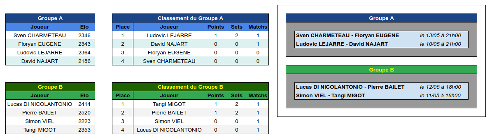

Guingamp_Echecs Stream, c'est l'histoire d'un groupe d'amis fans d'échecs qui ont pour point commun d'être tous passés par l'échiquier Guingampais. Après le succès de la retransmission de notre participation au championnat d'Europe des clubs, nous allons continuer à partager notre passion avec fun et pédagogie. Au programme session live, analyse et commentaires de compétitions !

Venez découvrir notre équipe sur [Twitch](https://www.twitch.tv/guingamp_echecs), [Youtube](https://www.youtube.com/channel/UCDa-Z-OF7U1xfGy3s835AxQ), et [Lichess](https://lichess.org/@/guingamp-echecs).

Nos prochains rendez-vous
======
  * Samedi 5 Juin à 18h00 : Juste des échecs
  * Dimanche 6 Juin à 20h45 : la finale, MI Lucas DI NICOLANTONIO vs MI Pierre BAILET
  * Mardi 8 Juin à 21h00 : le match du mardi (Briac et Tangi aux commentaires)
  * Samedi 12 Juin à 21h00 : tournoi inter-ligue 6ème édition

Challenge Gwengamp Chess
======

Du 8 Mai au 6 Juin, nous organisons un tournoi exceptionnel avec 8 joueurs, revoir [la présentation sur youtube](https://www.youtube.com/watch?v=ARqkzBN-I2k).
La phase de poules est terminée et à vu la qualification des 2 premiers de chaque poule pour les demi-finales :    

Le tableau de la phase finale :    

Restez connecté pour connaître les prochains streams.
Le détail des appariements, calendrier des matchs et classements sont disponibles [sur ce lien](https://docs.google.com/spreadsheets/d/1KcM92fU3VAFJtJLrZHnmAvBvIPzSW0i4ZX-RKlkoq_I/edit?usp=sharing).

Retrouvez les parties du challenge sur Lichess dans l'étude [Meilleurs parties Trophée gwengamp chess partie I](https://lichess.org/study/amDirdX3), [partie II](https://lichess.org/study/Kh26x8Kf) et maintenant [la phase finale](https://lichess.org/study/D7Dk1Z3D).

News
======

  

